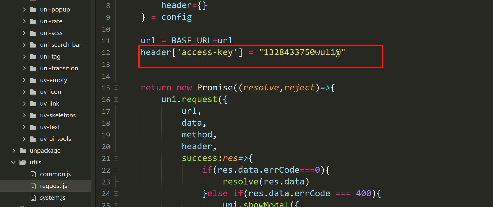

# 零儿爱喵喵壁纸小程序@wuli-git

## 项目简介
基于 `uni-app + Vue3 setup` 开发的壁纸预览项目。  
支持多端运行：微信小程序、APP、H5、PC 端。

## 在线体验

- 点击即可访问：[`00wallpaper 在线体验`](https://cc00mi.github.io/00wallpaper/)

## 功能特色

- 壁纸 swiper 左右滑动轮播预览
- 点击图片显示/隐藏顶部底部遮罩栏
- 实时显示当前时间、日期、当前页/总数
- 壁纸信息弹窗：ID、发布者、评分、标签、简介
- 支持半星评分、重复评分拦截
- 多端适配下载壁纸，小程序/APP 保存到相册
- H5/PC 端支持提示右键保存

## 技术栈

- 框架：`uni-app`
- 语法：`Vue3 script setup`
- 样式：`SCSS`
- UI 组件：`uni-ui`
- 接口：自定义后端 API

## 运行方式(适合想要二次开发者）

1. 导入 `HBuilderX`
2. 安装依赖
3. 获取 API 密钥  
   通过 `api.qingnian8.com`，通过看广告获取自定义 API 密钥：`1328433750wuli@`

   或者也可以自己自定义，去下图位置：

   

   把 `access-key` 改成你自己的密钥 KEY

4. 运行到浏览器 / 小程序模拟器 / App

## 本项目仅供学习使用
